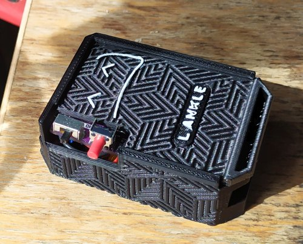
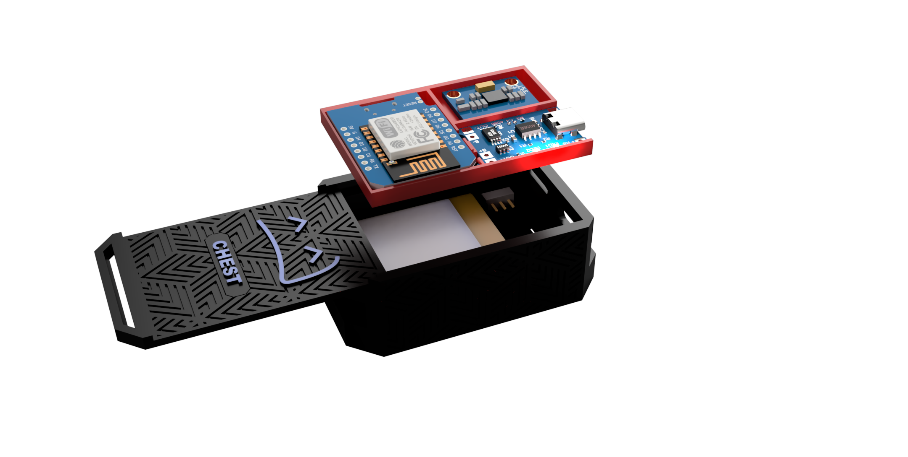
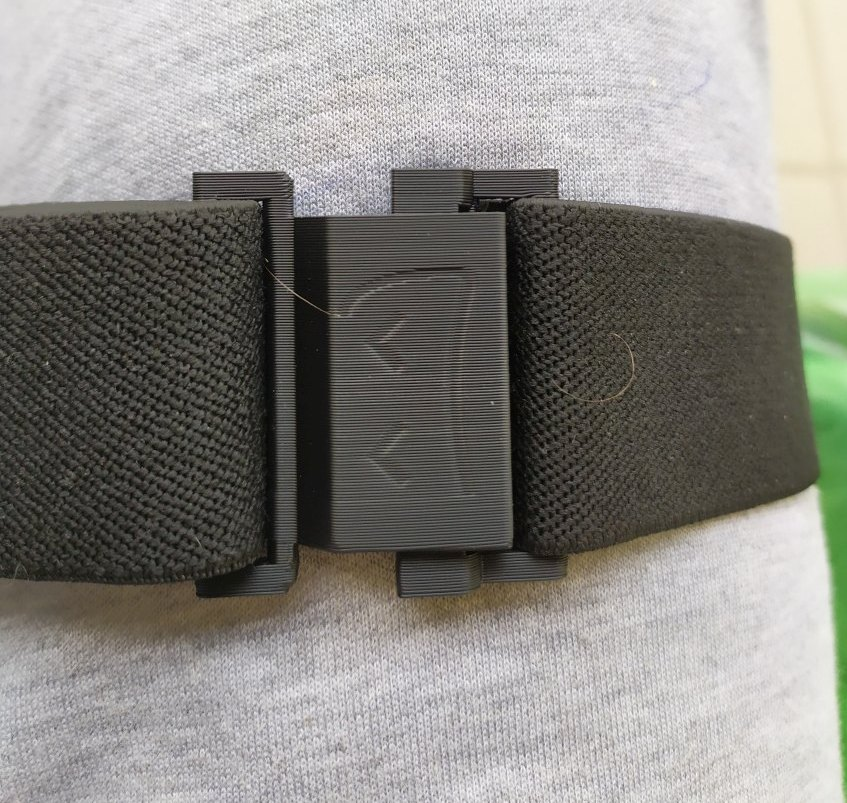
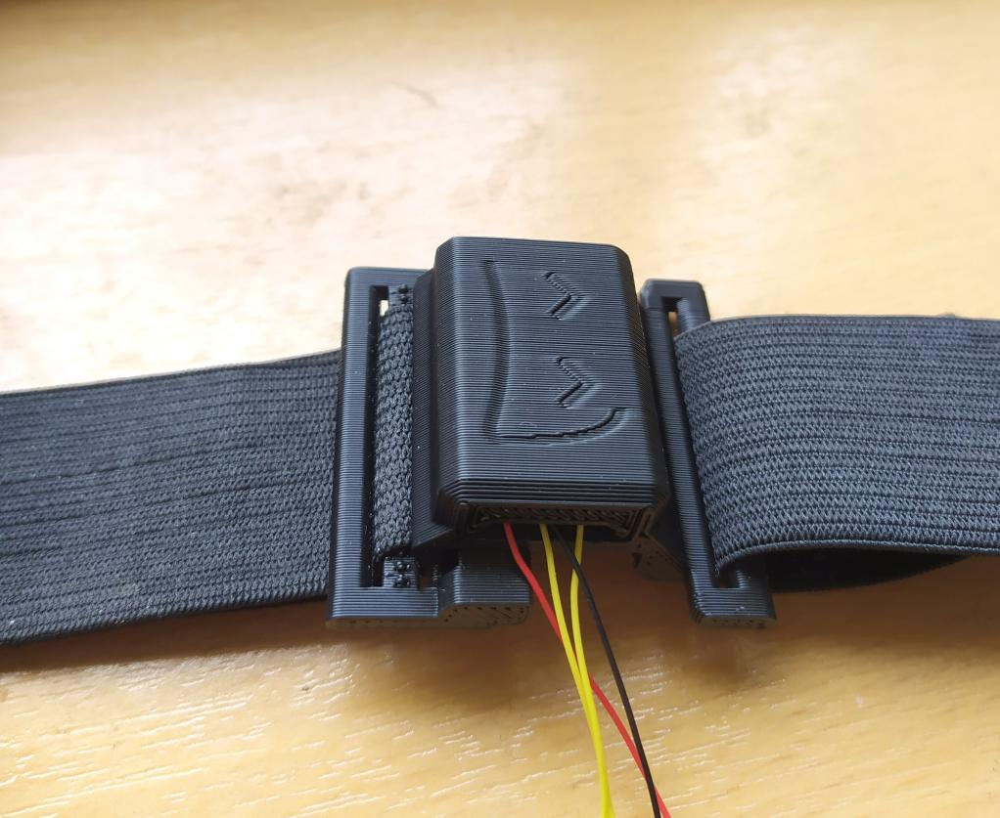
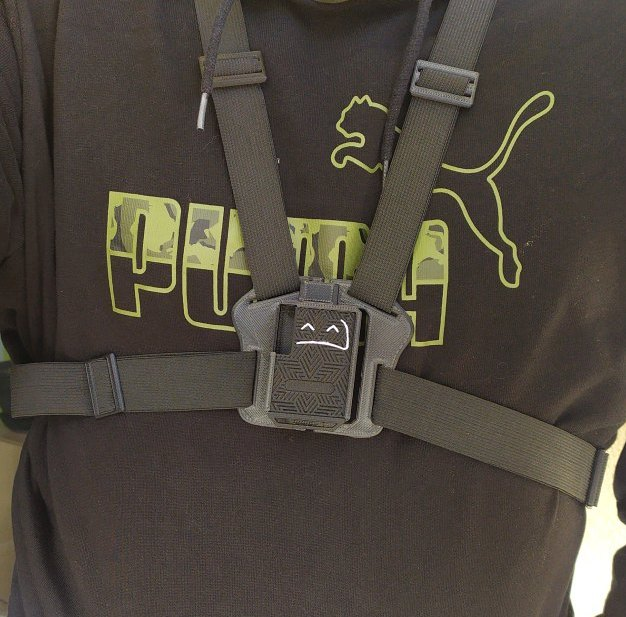
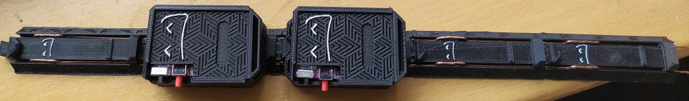
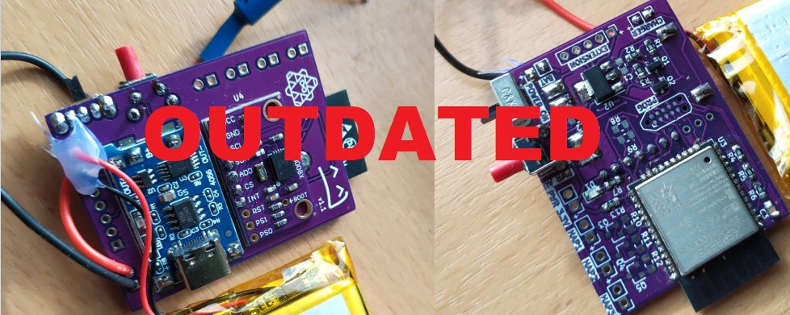

<h2>About</h2>
This repository stores various files and models made by me, to be used with the <a href="https://www.crowdsupply.com/slimevr/slimevr-full-body-tracker">SlimeVR project</a>
 
Some of the things in here are WIP so take that into account.
  

<h2>Quick navigation</h2>
<ul>
	<li><a href="#case">Tacker case</a></li>
	<li><a href="#buckles">Belt buckles</a></li>
	<li><a href="#dock">Charging dock</a></li>
	<li><a href="#tracker-pcb">Tracker PCB</a></li>
</ul>

<h2 id="case">Tracker case</h2>
STL files for the tracker case. <a href="case">Download here</a>  

 

I got a few requests for the case files for my tracker case, however since the original case is custom designed for my custom PCB, I decided to make a modified version, which is basically the same, except it has been designed to work well with standard DIY parts used to make the trackers, such as the WeMos D1 and MPU6050. 
The case features a tray design, which I decided to so since I saw this design used in <a href="https://github.com/Smeltie/Hyperion">Smeltie's Hyperion case</a> and liked how simple and easy to use it was. The tray will fit a standard WeMos D1 mini, TP4056 charger module, <a href="https://www.aliexpress.com/wholesale?catId=0&SearchText=SS12D00G3">SS12D00G3 switch</a> (it's a nice small and compact one) 
and a 1200mah 804040 LiPo battery, which is the one recommended in the pinned post in the DIY section of the discord, its size is 40x40x8mm. If your battery is a different size, you can use it too, however you might for example need to add some extra padding under the tray. Basically, as long as none of the dimensions are bigger than the 40x40x8mm you will be able to fit it in the case. 
This case is compatible with the charging dock.  

<b>How to print:</b> 
The lid for the cases has to be printed while standing on its side, otherwise the pattern will not look good. Use a raft, no supports needed.

<h2 id="buckles">Belt buckles</h2>
STL files for the buckles you can use to attach the trackers. <a href="buckles">Download here</a>  

	 
	 
	 

https://user-images.githubusercontent.com/106062742/169873555-18927d53-8dc6-4269-aad9-062308e2c8dd.mp4

 
In order to use the trackers, you need some way to attach them to your body. There are several solutions, such as using velcro straps with typical threeprong push-to-release clasps. 
In my testing I found the best solution to be wide rubber bands, because they keep their tension while at the same time to do so, they don't have to be overtightened, which would make it more uncomfortable to wear. 
You could use the quick release clasps, to hook the belt ends together, however I found a simpler and faster solution in the form of a simple hook design, where the clasp is held together by the tension of the belt. 
This will allow you to easily put the trackers on, or take them off, without having to press any latch release buttons and such. 
<i>Extension case</i> 
The files also contain a buckle design with built in housing for an extension IMU, so that way no extra case for it is required, making it more compact. 
<i>Chest harness</i> 
You can use a regular case with the belt to wear the chest tracker, but I found it to be not sufficiently stable that way. And since the movement of the chest tracker affects the bulk of the body, it's important for it to be mounted in a stable way. 
A chest harness is a good solution to this, since it uses 3 separate belts to stabilize the tracker and prevent any unwanted movement. The chest harness design is fully compatible with the charging dock. The harness files will include one with my case design built in, and one with no case, so you can attach your own.
  

<b>How to print:</b> 
Print both buckle pieces standing on their side. 
The primary buckle piece needs to have supports under the hook part.
I recommend using a raft but it's optional. 
There are several sizes of the secondary buckle piece included, I recommend using the one that gives a nice tight fit for the belt you are using, in order to prevent the belt from loosening over time. The best way is to print out all of them and test which one works best for you.
Belt attached to the hook part of the buckle should simply be pulled through the loop and then sewn shut, the length of the belt can be adjusted in the other piece of the buckle. 
For the chest harness, print it normally sitting down, on the big flat bottom, with supports under the hooks for the secondary part. If you experience issues with the hooks breaking during use, due to poor layer adhesion, you can try printing it standing on its side, which will considerably increase the hook durability.

  
The buckle is designed for a 38mm wide band, but you can use a smaller width as well. Since the buckle is held together by the two pieces hooked into each other, you need to use it with something elastic, ideally a wide rubber band <a href="https://www.aliexpress.com/item/1005003060064141.html?">like this one:</a> 
 

<h2 id="dock">Charging dock</h2>
STL files for the charging dock. <a href="dock">Download here</a>  
  
<b>If you have no experience with using and wiring up power supplies, make sure you read this entire section first. If you set yourself on fire, don't say I didn't warn you.</b>  
Tired of running a bunch of usb cables from a bunch of chargers and then connecting them to a bunch of your trackers every time you take them off in order to charge them? Then this is just the thing for you. 
The dock is very simple, it has magnets inside of it, which grab onto the trackers, align them and then they get charged by direct contact between two wires on the dock and two contacts on the tracker cases (+ and -). 
The charging thus works by direct metal on metal contact, it is not wireless and thus removes some of the drawbacks of wireless charging as well. 
  
<i>Will I electrocute myself?</i> 
If you are worried about getting "zapped" because the dock is featuring some exposed wires, it's actually pretty safe, we will be connecting very low voltage of around 5V DC to the rails so it's safe to touch. 
<i>What if accidentally short the rails?</i> 
A power source with short (or overcurrent) protection is highly recommended, so that if you accidentally short the rails together nothing will happen.  If you use a power source which limits the maximum current and you short the rails together with a thin wire for example, depending on the maximum current you could accidentally DIY a light bulb.
If you don't know what terms like "overcurrent protection" mean, don't attempt to build the dock until you at least see my tutorial (coming soon) on how to do it safely. 
<i>Can using the dock damage my trackers?</i> 
No. The only way to damage the tracker would be to plug it in backwards, and we will be using a diode for reverse polarity protection, so even if you put the tracker on the dock backwards, then nothing will happen. 
<i>What sort of power source do I need?</i> 
The voltage will depend on the way you normally charge your tracker. If you are using the typical TP4056 charging board and a single cell lipo battery, then 5V will be most likely fine. As for current, that depends on how many chargers you want to charge at the same time. If you didn't change the current setting resistor on your TP4056 module, then it is 
likely set to use 1A of charging current, which would mean that for 5 trackers you would need a power source that can supply at least 5A. If you have say 10 trackers, then getting your hands on a 10A power source could be tricky, so an easy solution is to build 2 separate 5slot docks. (Plus I don't recommend power sources that can output large amounts of current, because remember: light bulb)  
<i>What position can I mount this in?</i> 
I recommend either hanging it on the wall or placing it flat on the table. You could probably mount it upside down as well, but you have to test it first. 
<i>Do I have to remove the straps from the trackers to charge them on the dock?</i> 
Nope, you can charge them with the straps on. 
<i>What tracker cases is this compatible with?</i> 
Out of the box it's compatible only with my case design (see above), however modifying  other cases to work with it should not be too hard. 
<i>How can I build the dock?</i> 
All you need are some rare earth magnets (4 pieces of round 10x5mm per dock) and a copper wire capable of handling your max charging current. The dock is designed to use around 1.3mm dia solid copper wire which can easily handle charging 6 trackers at 6A without breaking a sweat and 
should also be able to handle up to 10 trackers, although I haven't personally tried it. Check the internet to find out maximum safe current for the diameter of the wire you are using. Like I said above, if you have a lot of trackers, then make multiple docks, don't make  a single dock for like 20 trackers, we aren't building an electric welder here.
When you print the dock, you need to pause the print at the layer height (for example by pasting M600 command into your gcode file, just before the correct layer starts printing), just before the holes get printed over, and insert the magnets, then finish the print, so the magnets get sealed in.
 
In order for the trackers to work with the dock we need to add two contact rails at the bottom, we will use a copper tape for this (and a diode!) to protect against reverse polarity. We will also need to embed a thin piece of magnetic metal at the bottom of the tracker, so the magnets in the dock can grab onto it. (Using magnets in the tracker case is not recommend, so they don't mess with the IMUs,
however the magnetic metal you will be using can get magnetized by the magnets, and possibly  mess with the magnetometer on the IMU, so be aware of that)
If you are experienced with electronics DIY, you will be able to do all of this easily, if not, then either let someone help you, or wait for me to make a tutorial, where I show you how to do it properly. Basically  the only danger here is using a power source than can't handle a short, or shorting the power rails with a metal thing and the metal thing getting hot due to that.
 
<i>Any maintenance?</i> 
I haven't used the dock for a very long time, but it's possible the contacts could get dirty over time and stop conducting, so you would need to clean them, however since I haven't been using the dock for long I can't say if this will be an issue or not.

<h2 id="tracker-pcb">Tracker PCB</h2>
Kicad + gerber files for the PCB fab.   The version 1.0 of the PCB is outdated, I made a version 2.0 which is much smaller (about 4x4cm) and has improved design. <a href="tracker-pcb">Download v2.0 here</a> (coming soon)  
 
 
I made a simple PCB which allows you to make a SlimeVR tracker by using the off the shelf TP4056 module,  BNO85 (or MPU6050) module and an ESP32, along with lipo battery.
It adds some extra features the official trackers currently don't have such as automatic shut-off if the trackers detect no movement for a certain period of time.
 <b>This probably won't be for most people, as it requires you to use and solder some SMD parts as well as a bare ESP32 module, and you can't use a simple USB cable to program it</b>, however I will publish the pcb design files here in case someone wants to use them.

